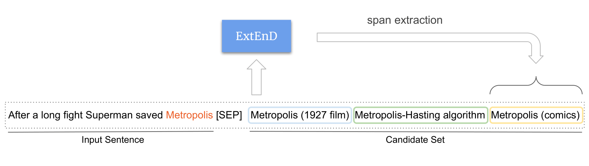

 <h1 align ="center"> ExtEnD: Extractive Entity Disambiguation </h1>

<p align="center">
    <a href="https://sunglasses-ai.github.io/classy/">
        
    </a>
    <a href="">
        
    </a>    
    <a href="https://pytorch.org/get-started/locally/">
        
    </a>
    <a href="https://spacy.io/">
        
    </a>
    <a href="https://black.readthedocs.io/en/stable/">
        
    </a>
        
</p>

This repository contains the code of [ExtEnD: Extractive Entity Disambiguation](https://www.researchgate.net/publication/359392427_ExtEnD_Extractive_Entity_Disambiguation), 
a novel approach to Entity Disambiguation (i.e. the task of linking a mention in context with its most suitable entity in a reference knowledge base) where we reformulate
this task as a text extraction problem. This work was accepted at ACL 2022.

If you find our paper, code or framework useful, please reference this work in your paper:

```
@inproceedings{barba-etal-2021-extend,
    title = "{E}xt{E}n{D}: Extractive Entity Disambiguation",
    author = "Barba, Edoardo  and
      Procopio, Luigi  and
      Navigli, Roberto",
    booktitle = "Proceedings of the 60th Annual Meeting of the Association for Computational Linguistics",
    month = may,
    year = "2022",
    address = "Online and Dublin, Ireland",
    publisher = "Association for Computational Linguistics",
}
```




ExtEnD is built on top of the [classy](https://sunglasses-ai.github.io/classy) library. If you are interested in using 
this project, we recommend checking first [its introduction](https://sunglasses-ai.github.io/classy/docs/intro/), although
it is not strictly required to train and use the models.

Finally, we also developed a few additional tools that make it simple to use and test ExtEnD models:
* a very simple [custom component](#spacy) for [spaCy](https://spacy.io/)
* a [demo](https://huggingface.co/spaces/poccio/ExtEnD) on HuggingFace Spaces
* a [docker image](#docker-container) running two services, a streamlit demo and a REST service

## Setup the environment

Requirements:
* Debian-based (e.g. Debian, Ubuntu, ...) system 
* [conda](https://docs.conda.io/en/latest/) installed

To quickly setup the environment to use ExtEnd/replicate our experiments, you can use the bash script *setup.sh*. The
only requirements needed here is to have a Debian-based system (Debian, Ubuntu, ...) and [conda](https://docs.conda.io/en/latest/) 
installed.

```
bash setup.sh
```

## Checkpoints

We release the following checkpoints:

|                                              Model                                              |  Training Dataset  | Avg Score |
|:-----------------------------------------------------------------------------------------------:|:--:|:------------:|
| [Longformer Large](https://drive.google.com/file/d/1XLBD8LSmXeMQ_-Khv6bSPcUhirNcz1SI/view?usp=sharing) | AIDA |    85.8     |

Once you have downloaded the files, untar them inside the *experiments/* folder.

```
# move file to experiments folder
mv ~/Downloads/extend-longformer-large.tar.gz experiments/
# untar
tar -xf experiments/extend-longformer-large.tar.gz -C experiments/
rm experiments/extend-longformer-large.tar.gz
```

## Data

All the datasets used to train and evaluate ExtEnD can be downloaded using the 
[following script](https://github.com/facebookresearch/GENRE/blob/main/scripts_genre/download_all_datasets.sh)
from the facebook [GENRE repository](https://github.com/facebookresearch/GENRE).

We strongly recommend you organize them in the following structure under the data folder as it is used by several 
scripts in the project.

```
data
├── aida
│   ├── test.aida
│   ├── train.aida
│   └── validation.aida
└── out_of_domain
    ├── ace2004-test-kilt.ed
    ├── aquaint-test-kilt.ed
    ├── clueweb-test-kilt.ed
    ├── msnbc-test-kilt.ed
    └── wiki-test-kilt.ed
```

## Training

To train a model from scratch, you just have to use the following command:

```bash
classy train qa <folder> -n my-model-name --profile aida-longformer-large-gam -pd extend
```

*<folder>* can be any folder containing exactly 3 files:
* *train.aida*
* *validation.aida*
* *test.aida*

This is required to let *classy* automatically discover the dataset splits. For instance, to re-train our AIDA-only model:
```bash
classy train data/aida -n my-model-name --profile aida-longformer-large-gam -pd extend
```

Note that *<folder>* can be **any folder**, as long as:
* it contains these 3 files
* they are in the same format as the files in *data/aida*

So if you want to train on these different datasets, just create the corresponding directory and you are ready to go!

In case you want to modify some training hyperparameter, you just have to edit the 
*aida-longformer-large-gam* profile in the *configurations/* folder. You can take a
look to the modifiable parameters by adding the parameter ``` --print ``` to the
training command. You can find more on this in 
[classy official documentation](https://sunglasses-ai.github.io/classy/docs/getting-started/customizing-things/config/).

## Predict

You can use classy syntax to perform [file prediction](https://sunglasses-ai.github.io/classy/docs/getting-started/basic/inference/#predicting):

```
classy predict -pd extend file \
    experiments/extend-longformer-large \
    data/aida/test.aida \
    -o data/aida_test_predictions.aida
```

## Evaluation

To evaluate a checkpoint, you can run the bash script *scripts/full_evaluation.sh*, passing its path as an input argument.
This will evaluate the model provided against both AIDA and OOD resources. 

```
# syntax: bash scripts/full_evaluation.sh <ckpt-path>
bash scripts/full_evaluation.sh experiments/extend-longformer-large/2021-10-22/09-11-39/checkpoints/best.ckpt
```

If you are interested in AIDA-only evaluation, you can use *scripts/aida_evaluation.sh* instead (same syntax).

Furthermore, you can evaluate the model on any dataset that respects the same format of the original ones
with the following command:

```
classy evaluate \
    experiments/extend-longformer-large/2021-10-22/09-11-39/checkpoints/best.ckpt \
    data/aida/test.aida \
    -o data/aida_test_evaluation.txt \
    -pd extend
```

## spaCy

You can also use ExtEnD with spaCy, allowing you to use our system with a seamless interface that tackles
**full end-to-end entity linking**. To do so, you just need to have cloned the repo and run *setup.sh* to 
configure the environment. Then, you will be able to add extend as a custom component in the following way:

```python
import spacy
from extend import spacy_component

nlp = spacy.load("en_core_web_sm")

extend_config = dict(
    checkpoint_path="<ckpt-path>",
    mentions_inventory_path="<inventory-path>",
    device=0,
    tokens_per_batch=4000,
)

nlp.add_pipe("extend", after="ner", config=extend_config)

input_sentence = "Japan began the defence of their title " \
                 "with a lucky 2-1 win against Syria " \
                 "in a championship match on Friday."

doc = nlp(input_sentence)

# [(Japan, Japan National Footbal Team), (Syria, Syria National Footbal Team)]
disambiguated_entities = [(ent.text, ent._.disambiguated_entity) for ent in doc.ents]
```

Where: 
* `<ckpt-path>` is the path to a pretrained checkpoint of extend that
you can find in the [Checkpoints section](#checkpoints), and
* `<inventory-path>` is the path to a file containing the mapping from mentions to the corresponding candidates.

We support two formats for `<inventory-path>`:
* **tsv**:
  ```bash
  $ head -1 <inventory-path>
  Rome \[TAB\] Rome City \[TAB\] Rome Football Team \[TAB\] Roman Empire \[TAB\] ...
  ``` 
  That is, `<inventory-path>` is a tab-separated file where, for each row, we have the mention (*Rome*) followed by its possible entities.
* **sqlite**: a sqlite3 database with a *candidate* table with two columns:
  * *mention* (text PRIMARY KEY)
  * *entities* (text). This must be a tab-separated list of the corresponding entities.

We release 6 possible pre-computed `<inventory-path>` that you could use (we recommend creating a folder *data/inventories/*
and placing the files downloaded there inside, e.g., *<inventory-path> = data/inventories/le-and-titov-2018-inventory.min-count-2.sqlite3*):
|                                              Inventory                                              |  Number of Mentions  | Source |
|:-----------------------------------------------------------------------------------------------:|:--:|:------------:|
| [le-and-titov-2018-inventory.min-count-2.tsv](https://drive.google.com/file/d/15Xgv3EuuKg8TsOml42TtHkBHDF5im022/view?usp=sharing) | 12090972 |    Cleaned version of the candidate set released by [Le and Titov (2018)](https://aclanthology.org/P18-1148/). We discard mentions whose count is less than 2.     |
| [**Recommended**] [le-and-titov-2018-inventory.min-count-2.sqlite3](https://drive.google.com/file/d/1YIb55cIM2D3fIc1OHA5kYN_vEsaRQOsO/view?usp=sharing) | 12090972 |    Cleaned version of the candidate set released by [Le and Titov (2018)](https://aclanthology.org/P18-1148/). We discard mentions whose count is less than 2.     |
| [le-and-titov-2018-inventory.tsv](https://drive.google.com/file/d/19ycTznwIt40s6pdwzjdOZEhV5oA8uRlN/view?usp=sharing) | 21571265 |    The candidate set released by [Le and Titov (2018)](https://aclanthology.org/P18-1148/)     |
| [le-and-titov-2018-inventory.sqlite3](https://drive.google.com/file/d/1ksbomzYc0un4XQeb-BU1BYvVV1NqK_Nv/view?usp=sharing) | 21571265 |    The candidate set released by [Le and Titov (2018)](https://aclanthology.org/P18-1148/)     |

Note that, as far as you respect either of these two formats, you can also create and use your own inventory!

## Docker container
 
Finally, we also release a [docker image](https://hub.docker.com/repository/docker/poccio/extend) running two services, a streamlit demo and a REST service:
```bash
$ docker run -p 22001:22001 -p 22002:22002 --rm -itd poccio/extend:1.0.1
<container id>
```
 
 Now you can:
 * checkout the streamlit demo at http://127.0.0.1:22001/
 * invoke the REST service running at http://127.0.0.1:22002/ (http://127.0.0.1:22002/docs you can find the OpenAPI documentation):
   ```bash
   $ curl -X POST http://127.0.0.1:22002/ -H 'Content-Type: application/json' -d '[{"text": "Rome is in Italy"}]'
   [{"text":"Rome is in Italy","disambiguated_entities":[{"char_start":0,"char_end":4,"mention":"Rome","entity":"Rome"},{"char_start":11,"char_end":16,"mention":"Italy","entity":"Italy"}]}]
   ```
 
## Acknowledgments

The authors gratefully acknowledge the support of the ERC Consolidator Grant [MOUSSE](http://mousse-project.org) No. 726487 under the European Union’s Horizon 2020 research and innovation programme.

This work was supported in part by the MIUR under grant “Dipartimenti di eccellenza 2018-2022” of the Department of Computer Science of the Sapienza University of Rome.

## License

This work is under the [Attribution-NonCommercial-ShareAlike 4.0 International (CC BY-NC-SA 4.0) license](https://creativecommons.org/licenses/by-nc-sa/4.0/).
